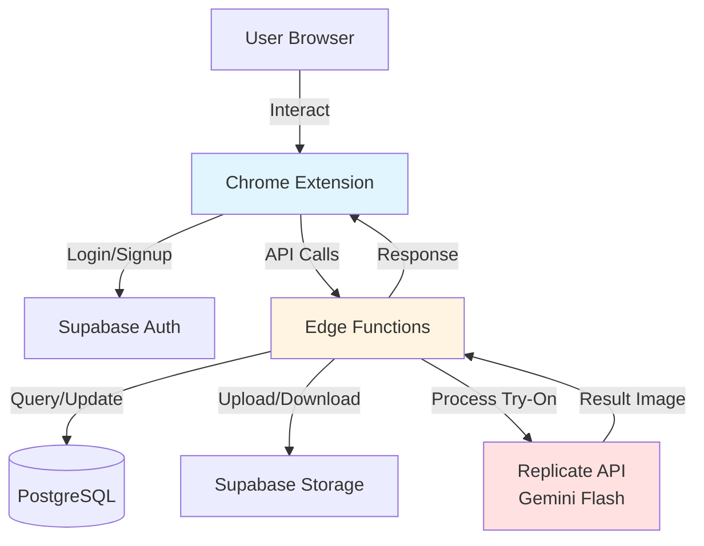
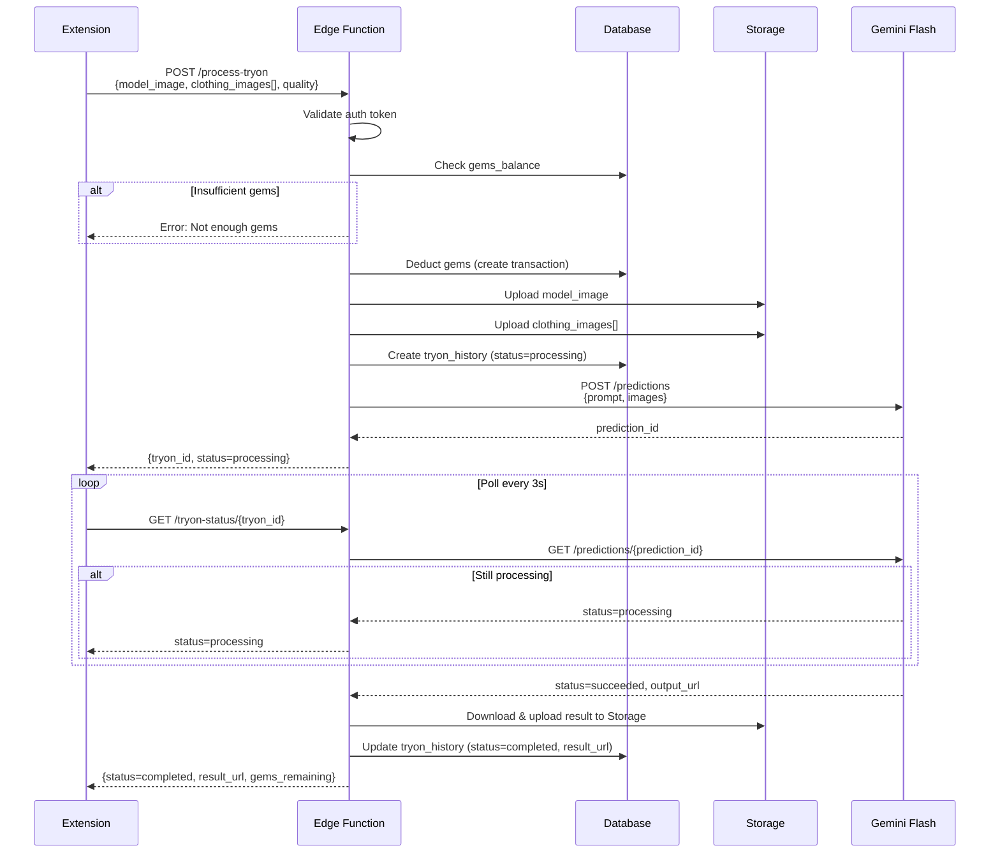

# Design Document

## Overview

Hệ thống **Supabase Backend Integration với Gemini AI Try-On** được thiết kế theo kiến trúc 3-tier với Chrome Extension làm presentation layer, Supabase Edge Functions làm application layer, và Supabase PostgreSQL + Storage làm data layer. Gemini Flash AI model (qua Replicate) được gọi từ Edge Functions để xử lý virtual try-on.

**Kiến trúc bảo mật:** Extension không được phép gọi trực tiếp đến Replicate API. Mọi request phải đi qua Edge Functions để validate authentication, kiểm tra gems balance, và bảo vệ API keys.

**Tech Stack:**
- Frontend: Chrome Extension (JavaScript)
- Backend: Supabase Edge Functions (Deno/TypeScript)
- Database: Supabase PostgreSQL
- Storage: Supabase Storage
- AI: Gemini Flash via Replicate API
- Auth: Supabase Auth

## Architecture

### System Architecture Diagram



### Data Flow: Try-On Request



## Components and Interfaces

### 1. Chrome Extension Components

**Supabase Client Wrapper**
```typescript
// File: extension/lib/supabase_client.ts
// Purpose: Singleton wrapper cho Supabase client
// Layer: Infrastructure

import { createClient } from '@supabase/supabase-js'

const supabaseUrl = 'https://[project-id].supabase.co'
const supabaseAnonKey = '[anon-key]'

export const supabase = createClient(supabaseUrl, supabaseAnonKey)

export async function getAuthToken(): Promise<string | null> {
  const { data } = await supabase.auth.getSession()
  return data.session?.access_token ?? null
}
```

**Try-On Service**
```typescript
// File: extension/services/tryon_service.ts
// Purpose: Handle try-on requests và polling
// Layer: Application
// Data Contract:
// - Input: { modelImageFile: File, clothingImages: File[], quality: 'standard' | 'hd' }
// - Output: { tryonId: string, resultUrl: string, gemsUsed: number }
// Flow:
// 1. Upload images to base64
// 2. Call Edge Function process-tryon
// 3. Poll status every 3s
// 4. Return result when completed
// Security Note: Validate file size < 10MB, type = jpg/png

interface TryOnRequest {
  modelImage: string // base64
  clothingImages: string[] // base64 array
  quality: 'standard' | 'hd'
}

interface TryOnResponse {
  tryonId: string
  status: 'processing' | 'completed' | 'failed'
  resultUrl?: string
  gemsUsed: number
  gemsRemaining: number
  error?: string
}

export async function processTryOn(
  modelImageFile: File,
  clothingImages: File[],
  quality: 'standard' | 'hd'
): Promise<TryOnResponse> {
  // Implementation in tasks
}
```

### 2. Supabase Edge Functions

**Function: process-tryon**
```typescript
// File: supabase/functions/process-tryon/index.ts
// Purpose: Main try-on processing logic
// Layer: Application
// Data Contract:
// - Input: { model_image: base64, clothing_images: base64[], quality: string }
// - Output: { tryon_id: UUID, status: string, result_url?: string }
// Flow:
// 1. Validate JWT token
// 2. Check gems balance
// 3. Deduct gems (atomic transaction)
// 4. Upload images to Storage
// 5. Construct Gemini prompt
// 6. Call Replicate API
// 7. Save tryon_history record
// 8. Return tryon_id for polling
// Security Note: Rate limit 10 req/min, validate image size/type

import { serve } from 'https://deno.land/std@0.168.0/http/server.ts'
import { createClient } from 'https://esm.sh/@supabase/supabase-js@2'

interface ProcessTryOnRequest {
  model_image: string
  clothing_images: string[]
  quality: 'standard' | 'hd'
}

serve(async (req) => {
  // Implementation in tasks
})
```

**Function: get-tryon-status**
```typescript
// File: supabase/functions/get-tryon-status/index.ts
// Purpose: Poll try-on processing status
// Layer: Application
// Data Contract:
// - Input: { tryon_id: UUID }
// - Output: { status: string, result_url?: string, error?: string }
// Flow:
// 1. Validate JWT token
// 2. Query tryon_history by ID
// 3. Check RLS policy (user owns this record)
// 4. If status=processing, check Replicate prediction status
// 5. If completed, return result_url
// Security Note: RLS ensures user can only query their own records

serve(async (req) => {
  // Implementation in tasks
})
```

**Function: upload-image**
```typescript
// File: supabase/functions/upload-image/index.ts
// Purpose: Upload và resize image to Storage
// Layer: Infrastructure
// Data Contract:
// - Input: { image: base64, bucket: string, path: string }
// - Output: { url: string, size: number }
// Flow:
// 1. Decode base64
// 2. Validate file type (jpg/png)
// 3. Resize to max 1024px using sharp/imagick
// 4. Upload to Storage bucket
// 5. Return public URL
// Security Note: Validate file size < 10MB before processing

serve(async (req) => {
  // Implementation in tasks
})
```

**Function: get-gems-balance**
```typescript
// File: supabase/functions/get-gems-balance/index.ts
// Purpose: Get current user gems balance
// Layer: Application
// Data Contract:
// - Input: None (uses JWT token)
// - Output: { gems_balance: number }
// Flow:
// 1. Validate JWT token
// 2. Extract user_id from token
// 3. Query profiles.gems_balance
// 4. Return balance
// Security Note: RLS policy ensures user can only see their own balance

serve(async (req) => {
  // Implementation in tasks
})
```

### 3. Database Functions

**Function: deduct_gems_atomic**
```sql
-- File: supabase/migrations/002_create_functions.sql
-- Purpose: Atomic gems deduction with transaction logging
-- Data Contract:
-- - Input: user_id UUID, amount INTEGER, tryon_id UUID
-- - Output: new_balance INTEGER
-- Flow:
-- 1. Lock profiles row for update
-- 2. Check balance >= amount
-- 3. Update gems_balance
-- 4. Insert gem_transactions record
-- 5. Return new balance
-- Security Note: Uses row-level locking to prevent race conditions

CREATE OR REPLACE FUNCTION deduct_gems_atomic(
  p_user_id UUID,
  p_amount INTEGER,
  p_tryon_id UUID
) RETURNS INTEGER AS $$
DECLARE
  v_new_balance INTEGER;
BEGIN
  -- Implementation in tasks
END;
$$ LANGUAGE plpgsql;
```

**Function: refund_gems_atomic**
```sql
-- File: supabase/migrations/002_create_functions.sql
-- Purpose: Refund gems when try-on fails
-- Data Contract:
-- - Input: user_id UUID, amount INTEGER, tryon_id UUID
-- - Output: new_balance INTEGER

CREATE OR REPLACE FUNCTION refund_gems_atomic(
  p_user_id UUID,
  p_amount INTEGER,
  p_tryon_id UUID
) RETURNS INTEGER AS $$
BEGIN
  -- Implementation in tasks
END;
$$ LANGUAGE plpgsql;
```

## Data Models

### Database Schema

```sql
-- File: supabase/migrations/001_initial_schema.sql
-- Purpose: Create all tables, indexes, and RLS policies

-- Profiles (extends auth.users)
CREATE TABLE profiles (
  id UUID PRIMARY KEY REFERENCES auth.users(id) ON DELETE CASCADE,
  email TEXT NOT NULL,
  full_name TEXT,
  gems_balance INTEGER NOT NULL DEFAULT 0 CHECK (gems_balance >= 0),
  created_at TIMESTAMPTZ NOT NULL DEFAULT NOW(),
  updated_at TIMESTAMPTZ NOT NULL DEFAULT NOW()
);

CREATE INDEX idx_profiles_id ON profiles(id);

-- User Models (full-body photos)
CREATE TABLE user_models (
  id UUID PRIMARY KEY DEFAULT gen_random_uuid(),
  user_id UUID NOT NULL REFERENCES profiles(id) ON DELETE CASCADE,
  image_url TEXT NOT NULL,
  is_default BOOLEAN NOT NULL DEFAULT FALSE,
  created_at TIMESTAMPTZ NOT NULL DEFAULT NOW()
);

CREATE INDEX idx_user_models_user_id ON user_models(user_id);
CREATE INDEX idx_user_models_default ON user_models(user_id, is_default) WHERE is_default = TRUE;

-- Wardrobe Items
CREATE TABLE wardrobe_items (
  id UUID PRIMARY KEY DEFAULT gen_random_uuid(),
  user_id UUID NOT NULL REFERENCES profiles(id) ON DELETE CASCADE,
  image_url TEXT NOT NULL,
  name TEXT,
  category TEXT NOT NULL CHECK (category IN ('top', 'bottom', 'dress', 'shoes', 'accessories')),
  source_url TEXT,
  created_at TIMESTAMPTZ NOT NULL DEFAULT NOW()
);

CREATE INDEX idx_wardrobe_user_category ON wardrobe_items(user_id, category);
CREATE INDEX idx_wardrobe_created ON wardrobe_items(user_id, created_at DESC);

-- Try-On History
CREATE TABLE tryon_history (
  id UUID PRIMARY KEY DEFAULT gen_random_uuid(),
  user_id UUID NOT NULL REFERENCES profiles(id) ON DELETE CASCADE,
  model_image_url TEXT NOT NULL,
  clothing_image_urls JSONB NOT NULL,
  result_image_url TEXT,
  gems_used INTEGER NOT NULL,
  quality TEXT NOT NULL CHECK (quality IN ('standard', 'hd')),
  status TEXT NOT NULL CHECK (status IN ('processing', 'completed', 'failed')),
  replicate_prediction_id TEXT,
  error_message TEXT,
  created_at TIMESTAMPTZ NOT NULL DEFAULT NOW(),
  completed_at TIMESTAMPTZ
);

CREATE INDEX idx_tryon_user_status ON tryon_history(user_id, status);
CREATE INDEX idx_tryon_user_created ON tryon_history(user_id, created_at DESC);
CREATE INDEX idx_tryon_prediction ON tryon_history(replicate_prediction_id) WHERE replicate_prediction_id IS NOT NULL;

-- Gem Transactions
CREATE TABLE gem_transactions (
  id UUID PRIMARY KEY DEFAULT gen_random_uuid(),
  user_id UUID NOT NULL REFERENCES profiles(id) ON DELETE CASCADE,
  amount INTEGER NOT NULL,
  type TEXT NOT NULL CHECK (type IN ('purchase', 'tryon', 'refund')),
  tryon_id UUID REFERENCES tryon_history(id) ON DELETE SET NULL,
  created_at TIMESTAMPTZ NOT NULL DEFAULT NOW()
);

CREATE INDEX idx_gem_trans_user ON gem_transactions(user_id, created_at DESC);
CREATE INDEX idx_gem_trans_tryon ON gem_transactions(tryon_id) WHERE tryon_id IS NOT NULL;
```

### Row Level Security Policies

```sql
-- File: supabase/migrations/003_rls_policies.sql
-- Purpose: Implement RLS policies for data security

-- Profiles: Users can only read/update their own profile
ALTER TABLE profiles ENABLE ROW LEVEL SECURITY;

CREATE POLICY "Users can view own profile"
  ON profiles FOR SELECT
  USING (auth.uid() = id);

CREATE POLICY "Users can update own profile"
  ON profiles FOR UPDATE
  USING (auth.uid() = id);

-- User Models: Users can only manage their own models
ALTER TABLE user_models ENABLE ROW LEVEL SECURITY;

CREATE POLICY "Users can view own models"
  ON user_models FOR SELECT
  USING (auth.uid() = user_id);

CREATE POLICY "Users can insert own models"
  ON user_models FOR INSERT
  WITH CHECK (auth.uid() = user_id);

CREATE POLICY "Users can delete own models"
  ON user_models FOR DELETE
  USING (auth.uid() = user_id);

-- Wardrobe Items: Users can only manage their own wardrobe
ALTER TABLE wardrobe_items ENABLE ROW LEVEL SECURITY;

CREATE POLICY "Users can view own wardrobe"
  ON wardrobe_items FOR SELECT
  USING (auth.uid() = user_id);

CREATE POLICY "Users can insert own wardrobe"
  ON wardrobe_items FOR INSERT
  WITH CHECK (auth.uid() = user_id);

CREATE POLICY "Users can delete own wardrobe"
  ON wardrobe_items FOR DELETE
  USING (auth.uid() = user_id);

-- Try-On History: Users can only view their own history
ALTER TABLE tryon_history ENABLE ROW LEVEL SECURITY;

CREATE POLICY "Users can view own history"
  ON tryon_history FOR SELECT
  USING (auth.uid() = user_id);

-- Gem Transactions: Users can only view their own transactions
ALTER TABLE gem_transactions ENABLE ROW LEVEL SECURITY;

CREATE POLICY "Users can view own transactions"
  ON gem_transactions FOR SELECT
  USING (auth.uid() = user_id);
```

### Storage Buckets Structure

```
users/
  {user_id}/
    models/
      {uuid}.jpg
      {uuid}.jpg
    wardrobe/
      {uuid}.jpg
      {uuid}.jpg
    results/
      {uuid}.jpg
      {uuid}.jpg
```

**Storage RLS Policies:**
```sql
-- File: supabase/migrations/004_storage_policies.sql
-- Purpose: Secure Storage buckets with RLS

-- Users bucket: Users can only access their own folder
CREATE POLICY "Users can upload to own folder"
  ON storage.objects FOR INSERT
  WITH CHECK (
    bucket_id = 'users' AND
    (storage.foldername(name))[1] = auth.uid()::text
  );

CREATE POLICY "Users can read own files"
  ON storage.objects FOR SELECT
  USING (
    bucket_id = 'users' AND
    (storage.foldername(name))[1] = auth.uid()::text
  );

CREATE POLICY "Users can delete own files"
  ON storage.objects FOR DELETE
  USING (
    bucket_id = 'users' AND
    (storage.foldername(name))[1] = auth.uid()::text
  );
```

## Gemini Flash Prompt Engineering

### Prompt Construction Strategy

**Prompt Template:**
```typescript
// File: supabase/functions/lib/construct_gemini_prompt.ts
// Purpose: Build dynamic prompt for Gemini Flash based on clothing items
// Layer: Domain
// Data Contract:
// - Input: { modelAnalysis: object, clothingItems: object[] }
// - Output: { prompt: string, negativePrompt: string }

interface ModelAnalysis {
  gender: 'male' | 'female' | 'unisex'
  pose: string
  lighting: string
  background: string
}

interface ClothingItem {
  category: 'top' | 'bottom' | 'dress' | 'shoes' | 'accessories'
  description: string
  color: string
  style: string
}

function constructGeminiPrompt(
  modelAnalysis: ModelAnalysis,
  clothingItems: ClothingItem[],
  quality: 'standard' | 'hd'
): { prompt: string; negativePrompt: string } {
  
  const basePrompt = `Professional fashion photography of a ${modelAnalysis.gender} person wearing:`
  
  // Sort items by category priority: dress > top > bottom > shoes > accessories
  const sortedItems = sortClothingByPriority(clothingItems)
  
  const clothingDescription = sortedItems.map(item => 
    `- ${item.category}: ${item.description}, ${item.color} color, ${item.style} style`
  ).join('\n')
  
  const preservationInstructions = `
CRITICAL REQUIREMENTS:
- Keep the person's face EXACTLY the same (facial features, expression)
- Keep hair style and color EXACTLY the same
- Keep body proportions and height EXACTLY the same
- Keep the original pose and posture
- Maintain ${modelAnalysis.lighting} lighting conditions
- Natural fabric textures and realistic wrinkles
- Professional studio quality
${quality === 'hd' ? '- Ultra high resolution 4K output' : '- High resolution output'}
`
  
  const negativePrompt = `
deformed, distorted face, wrong anatomy, extra limbs, blurry, low quality, 
watermark, text, logo, unrealistic proportions, cartoon, anime, 
different person, face swap, age change
`
  
  return {
    prompt: basePrompt + '\n' + clothingDescription + '\n' + preservationInstructions,
    negativePrompt: negativePrompt.trim()
  }
}
```

### Replicate API Integration

```typescript
// File: supabase/functions/lib/replicate_client.ts
// Purpose: Wrapper for Replicate API calls
// Layer: Infrastructure
// Data Contract:
// - Input: { prompt: string, modelImageUrl: string, clothingUrls: string[] }
// - Output: { predictionId: string }
// Security Note: API key from Deno.env.get('REPLICATE_API_KEY')

interface ReplicateRequest {
  version: string // Gemini Flash model version
  input: {
    prompt: string
    negative_prompt: string
    image: string // model image URL
    clothing_images: string[] // clothing URLs
    num_inference_steps: number
    guidance_scale: number
  }
}

async function createPrediction(
  prompt: string,
  negativePrompt: string,
  modelImageUrl: string,
  clothingUrls: string[]
): Promise<string> {
  
  const apiKey = Deno.env.get('REPLICATE_API_KEY')
  if (!apiKey) throw new Error('REPLICATE_API_KEY not configured')
  
  const response = await fetch('https://api.replicate.com/v1/predictions', {
    method: 'POST',
    headers: {
      'Authorization': `Token ${apiKey}`,
      'Content-Type': 'application/json'
    },
    body: JSON.stringify({
      version: 'gemini-flash-version-id', // TODO: Get actual version ID
      input: {
        prompt,
        negative_prompt: negativePrompt,
        image: modelImageUrl,
        clothing_images: clothingUrls,
        num_inference_steps: 50,
        guidance_scale: 7.5
      }
    })
  })
  
  const data = await response.json()
  return data.id // prediction ID
}

async function getPredictionStatus(predictionId: string): Promise<{
  status: 'starting' | 'processing' | 'succeeded' | 'failed'
  output?: string
  error?: string
}> {
  const apiKey = Deno.env.get('REPLICATE_API_KEY')
  
  const response = await fetch(
    `https://api.replicate.com/v1/predictions/${predictionId}`,
    {
      headers: { 'Authorization': `Token ${apiKey}` }
    }
  )
  
  return await response.json()
}
```

## Error Handling

### Error Types and Recovery

```typescript
// File: supabase/functions/lib/error_handler.ts
// Purpose: Centralized error handling and gem refund logic
// Layer: Application

enum ErrorType {
  INSUFFICIENT_GEMS = 'INSUFFICIENT_GEMS',
  INVALID_IMAGE = 'INVALID_IMAGE',
  REPLICATE_TIMEOUT = 'REPLICATE_TIMEOUT',
  REPLICATE_ERROR = 'REPLICATE_ERROR',
  STORAGE_ERROR = 'STORAGE_ERROR',
  DATABASE_ERROR = 'DATABASE_ERROR',
  RATE_LIMIT_EXCEEDED = 'RATE_LIMIT_EXCEEDED'
}

interface ErrorResponse {
  error: ErrorType
  message: string
  shouldRefund: boolean
  userMessage: string
}

function handleTryOnError(
  error: Error,
  userId: string,
  tryonId: string,
  gemsUsed: number
): ErrorResponse {
  
  // Map internal errors to user-friendly messages
  const errorMap: Record<ErrorType, ErrorResponse> = {
    [ErrorType.INSUFFICIENT_GEMS]: {
      error: ErrorType.INSUFFICIENT_GEMS,
      message: 'User does not have enough gems',
      shouldRefund: false,
      userMessage: 'Bạn không đủ Gem để thực hiện try-on. Vui lòng mua thêm Gem.'
    },
    [ErrorType.REPLICATE_TIMEOUT]: {
      error: ErrorType.REPLICATE_TIMEOUT,
      message: 'Replicate API timeout after 60s',
      shouldRefund: true,
      userMessage: 'Xử lý AI bị timeout. Gem đã được hoàn lại. Vui lòng thử lại.'
    },
    [ErrorType.REPLICATE_ERROR]: {
      error: ErrorType.REPLICATE_ERROR,
      message: 'Replicate API returned error',
      shouldRefund: true,
      userMessage: 'AI xử lý gặp lỗi. Gem đã được hoàn lại. Vui lòng thử lại với ảnh khác.'
    },
    // ... other error types
  }
  
  // Refund gems if needed
  if (errorResponse.shouldRefund) {
    await refundGemsAtomic(userId, gemsUsed, tryonId)
  }
  
  return errorResponse
}
```

### Retry Strategy

```typescript
// File: supabase/functions/lib/retry_helper.ts
// Purpose: Exponential backoff retry for network errors
// Layer: Infrastructure

async function retryWithBackoff<T>(
  fn: () => Promise<T>,
  maxRetries: number = 3,
  baseDelay: number = 1000
): Promise<T> {
  for (let i = 0; i < maxRetries; i++) {
    try {
      return await fn()
    } catch (error) {
      if (i === maxRetries - 1) throw error
      
      const delay = baseDelay * Math.pow(2, i)
      await new Promise(resolve => setTimeout(resolve, delay))
    }
  }
  throw new Error('Max retries exceeded')
}
```

## Testing Strategy

### Dual Testing Approach

Hệ thống sử dụng kết hợp **Unit Tests** và **Property-Based Tests** để đảm bảo correctness:

- **Unit Tests**: Kiểm tra các trường hợp cụ thể, edge cases, error conditions
- **Property Tests**: Kiểm tra các tính chất phổ quát trên nhiều inputs ngẫu nhiên

### Testing Tools

- **Unit Testing**: Deno Test (cho Edge Functions), Jest (cho Extension)
- **Property-Based Testing**: fast-check (JavaScript/TypeScript)
- **Database Testing**: pgTAP (PostgreSQL testing framework)
- **Integration Testing**: Postman/Newman

### Test Configuration

- Mỗi property test chạy tối thiểu **100 iterations**
- Mỗi test phải tag với format: `Feature: supabase-gemini-integration, Property {N}: {description}`
- Database tests chạy trên test database riêng, không dùng production data


## Correctness Properties

*A property is a characteristic or behavior that should hold true across all valid executions of a system—essentially, a formal statement about what the system should do. Properties serve as the bridge between human-readable specifications and machine-verifiable correctness guarantees.*

### Property Reflection

Sau khi phân tích 60+ acceptance criteria, tôi đã xác định các properties có thể consolidate:

**Redundancy Analysis:**
- Properties về RLS security (4.4, 8.5, 6.3) có thể gộp thành một property tổng quát về data isolation
- Properties về error refund (5.5, 10.1, 10.2) có thể gộp thành một property về refund consistency
- Properties về input validation (2.1, 7.6) là duplicate
- Properties về database consistency (2.3, 3.1) follow cùng pattern có thể generalize
- Properties về prompt content (9.3, 9.4) có thể gộp thành một property về prompt completeness

**Final Property Set:** 35 unique properties sau khi loại bỏ redundancy

### Authentication & Authorization Properties

**Property 1: Login Session Persistence**
*For any* valid email/password combination, when user logs in, the Extension should store a valid session token that can be used for subsequent authenticated requests.
**Validates: Requirements 1.1**

**Property 2: Logout Cleanup Completeness**
*For any* logged-in user state, when logout is triggered, all authentication data (session token, local storage) should be completely cleared.
**Validates: Requirements 1.3**

**Property 3: New User Profile Initialization**
*For any* new user registration, the system should automatically create a profile record with gems_balance = 0.
**Validates: Requirements 1.4**

**Property 4: Email Validation Correctness**
*For any* string input, the system should correctly identify valid email formats (contains @, valid domain) and reject invalid formats.
**Validates: Requirements 1.5**

### Image Management Properties

**Property 5: Image Upload Validation**
*For any* file upload, the system should accept only jpg/png formats with size <= 10MB, and reject all other files.
**Validates: Requirements 2.1, 7.6**

**Property 6: Image Resize Invariant**
*For any* valid image uploaded, after resize processing, the maximum dimension (width or height) should be <= 1024px.
**Validates: Requirements 2.2**

**Property 7: Storage-Database Consistency**
*For any* successful image upload, both a storage file and a corresponding database record should exist, and deleting one should delete the other.
**Validates: Requirements 2.3, 3.1, 3.3**

**Property 8: Default Model Uniqueness**
*For any* user at any time, there should be at most one model image with is_default = true.
**Validates: Requirements 2.4**

**Property 9: Upload URL Accessibility**
*For any* successful upload, the returned URL should be accessible and point to the correct uploaded image.
**Validates: Requirements 2.5**

### Wardrobe Properties

**Property 10: Category Validation**
*For any* wardrobe item save request, the category should be accepted only if it's in the allowed list: [top, bottom, dress, shoes, accessories].
**Validates: Requirements 3.2**

**Property 11: Wardrobe Query Filter Correctness**
*For any* category filter applied to wardrobe query, all returned items should have that exact category value.
**Validates: Requirements 3.4**

**Property 12: Source URL Persistence**
*For any* wardrobe item saved with a source_url, that URL should be stored and retrievable in subsequent queries.
**Validates: Requirements 3.5**

### Gem Management Properties

**Property 13: Gem Balance Display Consistency**
*For any* user, the gems_balance displayed in Extension should match the value in the profiles table.
**Validates: Requirements 4.1**

**Property 14: Gem Transaction Atomicity**
*For any* gem transaction, both the gems_balance update and the gem_transactions log entry should be created atomically (both succeed or both fail).
**Validates: Requirements 4.2, 12.5**

**Property 15: Gem Balance Non-Negativity Invariant**
*For any* user at any time, gems_balance should always be >= 0.
**Validates: Requirements 4.3**

**Property 16: Gem Audit Trail Completeness**
*For any* change in gems_balance, there should be a corresponding record in gem_transactions with correct type (purchase/tryon/refund).
**Validates: Requirements 4.5**

### Try-On Processing Properties

**Property 17: Try-On Precondition Validation**
*For any* try-on request, it should be rejected if auth token is invalid OR gems_balance is insufficient for the requested quality level.
**Validates: Requirements 5.1**

**Property 18: Gem Deduction Correctness**
*For any* try-on request with sufficient gems, the system should deduct exactly 1 gem for standard quality or 2 gems for HD quality before calling AI.
**Validates: Requirements 5.2**

**Property 19: Image Upload Ordering**
*For any* try-on request, all images (model + clothing) should be uploaded to Storage before the Gemini API call is made.
**Validates: Requirements 5.3**

**Property 20: Try-On Success State Transition**
*For any* successful Gemini API response, the tryon_history record should be updated with status = completed and result_image_url populated.
**Validates: Requirements 5.4**

**Property 21: Try-On Failure Refund Consistency**
*For any* try-on that fails (AI error, timeout, or upload error), the system should refund 100% of gems used and set status = failed.
**Validates: Requirements 5.5, 10.1, 10.2, 10.3**

**Property 22: Clothing Items Limit**
*For any* try-on request with more than 5 clothing items, the request should be rejected.
**Validates: Requirements 5.6**

**Property 23: Try-On Initial State**
*For any* new try-on request, a tryon_history record should be created with status = processing before AI processing begins.
**Validates: Requirements 5.7**

**Property 24: Prompt Dynamic Construction**
*For any* combination of clothing items, the generated prompt should include descriptions of all items with their correct categories.
**Validates: Requirements 5.8**

### Storage Properties

**Property 25: Storage Path Structure Compliance**
*For any* uploaded file, its storage path should follow the structure: users/{user_id}/{type}/ where type is models, wardrobe, or results.
**Validates: Requirements 6.1**

**Property 26: Filename Uniqueness**
*For any* two file uploads (even of the same image), the generated filenames should be different (UUID-based).
**Validates: Requirements 6.2**

**Property 27: Signed URL Expiration**
*For any* returned image URL, it should be a signed URL that expires after 1 hour.
**Validates: Requirements 6.4**

### Security Properties

**Property 28: Data Isolation via RLS**
*For any* user query (gems balance, wardrobe, history, storage files), the system should return only data owned by that user, never data from other users.
**Validates: Requirements 4.4, 6.3, 8.5**

**Property 29: Rate Limiting Enforcement**
*For any* user making more than 10 try-on requests within 1 minute, subsequent requests should be rejected with rate limit error.
**Validates: Requirements 7.3**

**Property 30: Authentication Required**
*For any* Edge Function endpoint, requests without valid auth token should be rejected with 401 Unauthorized.
**Validates: Requirements 7.4**

**Property 31: Error Message Sanitization**
*For any* error response, the message should be user-friendly and should not expose internal details (stack traces, database errors, API keys).
**Validates: Requirements 7.7**

### History Properties

**Property 32: History Query Ordering**
*For any* history query, results should be sorted by created_at in descending order (newest first).
**Validates: Requirements 8.1**

**Property 33: History Record Completeness**
*For any* history record returned, it should contain all required fields: model_image_url, clothing_image_urls, result_image_url (if completed), gems_used, quality, status.
**Validates: Requirements 8.2**

**Property 34: History Status Filter Correctness**
*For any* status filter applied to history query, all returned records should have that exact status value.
**Validates: Requirements 8.4**

### Prompt Engineering Properties

**Property 35: Prompt Preservation Instructions**
*For any* generated prompt, it should contain explicit instructions to preserve: face, hair, body shape, height, and original pose.
**Validates: Requirements 9.3, 9.4**

**Property 36: Prompt Category Hierarchy**
*For any* prompt with multiple clothing items, items should be ordered by category priority: dress > top+bottom > shoes > accessories.
**Validates: Requirements 9.5**

**Property 37: Prompt Quality Parameter Mapping**
*For any* quality setting (standard vs HD), the prompt should use different parameters: standard uses default settings, HD uses higher resolution and inference steps.
**Validates: Requirements 9.6**

### Error Handling Properties

**Property 38: Timeout Cancellation**
*For any* Gemini API call exceeding 60 seconds, the request should be cancelled, gems refunded, and status set to failed.
**Validates: Requirements 10.1**

**Property 39: Error Logging Completeness**
*For any* error during try-on processing, error details should be logged in tryon_history with status = failed.
**Validates: Requirements 10.4**

**Property 40: Retry Exponential Backoff**
*For any* network error, retry attempts should occur with exponentially increasing delays: 1s, 2s, 4s, etc.
**Validates: Requirements 10.6**

### Extension Integration Properties

**Property 41: Polling Interval Consistency**
*For any* try-on in processing state, the Extension should poll status every 3 seconds until status changes to completed or failed.
**Validates: Requirements 11.4**

**Property 42: Offline Mode Caching**
*For any* offline state, the Extension should display the last known cached gems_balance and show an offline warning.
**Validates: Requirements 11.6**

### Database Performance Properties

**Property 43: Query Result Limits**
*For any* wardrobe query, results should be limited to max 50 items; for any history query, results should be limited to max 100 items.
**Validates: Requirements 12.3**

**Property 44: Pagination Correctness**
*For any* paginated history query, each page should contain non-overlapping records, and all records should be retrievable across pages.
**Validates: Requirements 12.4**

